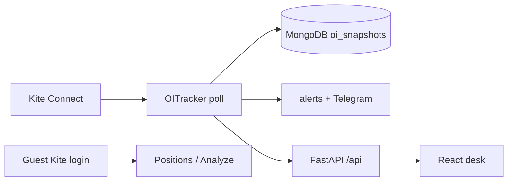

# OI Pulse — architecture

## System overview

OI Pulse is a **publisher-polled open-interest desk** for Indian index options. A FastAPI process uses one Zerodha Kite Connect token to poll option chains, upsert strike-level snapshots in MongoDB, and serve a React desk. Guests never share that token for their book.

## Frontend

- Entry: `frontend/src/pages/Dashboard.jsx` (active index, OI cache, tabs).
- Positions: `PositionsPanel.jsx` + `PositionsAnalyzeModal.jsx`.
- Domain JS: `frontend/src/lib/` — `universe.js`, `positionPayoff.js`, `holidays.js`, `journalYearHeat.js`.
- HTTP: `frontend/src/lib/api.js` (axios, admin/guest headers).
- State: React local state + refs for poll caches. No Redux.

The desk UI is **index-agnostic** given `enabled_indices` from `/config`. Strike step and labels come from `universe`.

## Backend

| Module | Role |
|--------|------|
| `server.py` | Routes, auth, CORS |
| `oi_tracker.py` | Async poll, settings, snapshot write, alerts |
| `oi_service.py` | Instruments dump → chain quotes → snapshot |
| `universe.py` | Catalog of underlyings; `desk_index_config()` feeds `INDEX_CONFIG` |
| `market_hours.py` | NSE session + holidays + Muhurat |
| `kite_positions.py` / `user_kite.py` | Publisher vs guest book |
| `trade_journal.py` | Admin journal snapshots |
| `notifier.py` | Telegram |

`INDEX_CONFIG` is **derived**, not a second hardcoded map. Adding Gold to the live board is a universe + hours + FUT-spot change, not a new copy of NIFTY.

## Database

See [DATA.md](./DATA.md). Snapshots key on `index` string (today `NIFTY` / `SENSEX` / `BANKNIFTY`). Future MCX ids would be new `index` values in the same collection — no new collection required.

## API

Prefix `/api`. `/config` returns `indices` (live `INDEX_CONFIG`) plus additive `universe` (full catalog including `pollable: false` MCX rows). OI routes: `/oi/{index}`, `/oi/{index}/change`, `/history/{index}`. Auth in [ABOUT.md](./ABOUT.md).

## Auth

Admin password → `admin_sessions` → `X-Admin-Token`. Remember-me IP-bound. Guest: public flag + approval → `X-Guest-Token`. Positions for guests: their Kite OAuth, not the publisher vault.

## Data flow (OI)

1. Tracker, if NSE session open (or `FORCE_ALWAYS_POLL`), calls `KiteService.get_snapshot` per enabled desk id.
2. Quote index (`NSE:NIFTY 50` etc.), round ATM by `step`, quote CE/PE tokens, store `oi` per strike.
3. Frontend polls change windows; does not call Kite.

## External integrations

- **Kite** — instruments CSV, quote (OI, LTP, OHLC, depth), positions, margins.
- **Telegram** — optional alerts / 15:15 IST wrap (never the book).
- **Optional LLM** — desk guide; see [AI.md](./AI.md).

## Deployment

Process + Mongo + static frontend. Hours and poll cadence are admin settings. See [HOSTING.md](./HOSTING.md), [LOCAL_SETUP.md](./LOCAL_SETUP.md).

## Decisions

- One poller, many underlyings via `universe` — [decisions/ADR-001-instrument-universe.md](./decisions/ADR-001-instrument-universe.md).
- NSE hours gate the poller today. MCX evening hours are **not** on that clock; do not enable MCX `pollable` until a calendar exists.
- Publisher OI vs guest book split is a product invariant.
