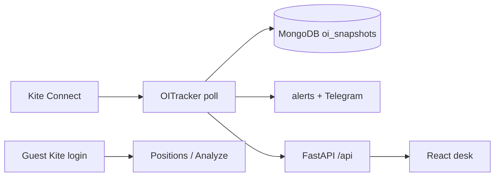

# StrikLenz — architecture

## System overview

StrikLenz is a **publisher-polled open-interest desk** for Indian index options. A FastAPI process uses one Zerodha Kite Connect token to poll option chains, upsert strike-level snapshots in MongoDB, and serve a React desk. Guests never share that token for their book.


```mermaid
flowchart LR
  Kite[Kite Connect] --> Tracker[OITracker poll]
  Tracker --> Mongo[(MongoDB oi_snapshots)]
  Tracker --> Alerts[alerts + Telegram]
  Tracker --> API[FastAPI /api]
  API --> React[React desk]
  GuestKite[Guest Kite login] --> Positions[Positions / Analyze]
```

## Frontend

- Entry: `frontend/src/pages/Dashboard.jsx` (active index, OI cache, tabs).
- Public showcase: `frontend/src/pages/SiteWalkthrough.jsx` gates an anonymous
  `/sitewalkthrough` route, then mounts the real `Dashboard.jsx` in demo mode.
  Route isolation recognizes case and percent-encoded variants as well, matching
  React Router's route behavior.
  `lib/siteWalkthroughApi.js` supplies fictional fixtures through an Axios
  adapter scoped to this pathname; dashboard reads do not reach the backend,
  and writes are held in memory. The only backend request is the public
  `/auth/state` availability check. Raw spot and straddle WebSockets are
  disabled; CAS and admin-only surfaces remain hidden.
  Synthetic index quotes, OI, options, and straddles share a deterministic
  clock and follow regular 09:15–15:30 IST NSE hours, with published
  special-session hours honored; closed markets hold the prior final sample.
  Fixture-backed Desk AI context and stable-cadence sample alerts are labelled.
  Admins control availability from the Header's Admin Settings menu; a disabled
  walkthrough stops at the public auth-state check and shows the maintenance
  screen without mounting the demo dashboard.
- Positions: `PositionsPanel.jsx` + `PositionsAnalyzeModal.jsx` + `PositionsBrainPanel.jsx` (short-book risk in `lib/positionsBrain.js`). The internal Risk Management view uses the same enriched open-position rows and poll lifecycle; scenario calculations live in `lib/positionsRisk.js`.
- Market Intel popup polls the user's already-scored `/market-intel/popup` candidates. It suppresses the existing queue on first load, then alerts once per newly appearing event cluster; foreground users get an in-app toast and opted-in users get the existing OS notification when the page is backgrounded. It does not create a separate news source or market signal.
- Desk AI and the carry brief request `/oi/{index}/change` only while `/market/status` reports `is_oi_polling: true`; missing status fails closed, preventing repeated after-hours OI requests while retaining the Dashboard's separate last-session display.
- Domain JS: `frontend/src/lib/` — `universe.js`, `positionPayoff.js`, `holidays.js`, `journalYearHeat.js`.
- Trade Journal archive imports are parsed and held in browser-tab memory; the imported cycle-ledger calendar is visibly separate from saved `trade_journal` P&L and never posts archive contents to the API.
- HTTP: `frontend/src/lib/api.js` (axios, admin/guest headers).
- State: React local state + refs for poll caches. No Redux.

The desk UI is **index-agnostic** given `enabled_indices` from `/config`. Strike step and labels come from `universe`.

## Backend

| Module | Role |
|--------|------|
| `server.py` | Routes, auth, CORS |
| `oi_tracker.py` | Async poll, settings, snapshot write, alerts |
| `oi_service.py` | Instruments dump → chain quotes → snapshot |
| `universe.py` | Catalog of underlyings; `desk_index_config()` feeds `INDEX_CONFIG` |
| `market_hours.py` | NSE + per-`session_group` MCX hours; Muhurat; journal EOD lock |
| `kite_positions.py` / `user_kite.py` | Publisher vs guest book |
| `cas_bridge.py` / `cas_rule_expiry_automation/` | Classic 15:28 CAS **SELL both** wings |
| `cas_auto_trade.py` / `cas_indicative_nse.py` | Separate 15:20 arm: NSE homepage `indicativeClose` vs frozen Kite NIFTY → one ATM **BUY**; manual exit. Operator manual: [CAS_AUTO_TRADE_15_20.md](./CAS_AUTO_TRADE_15_20.md) |
| `trade_journal.py` | Admin journal snapshots |
| `notifier.py` | Telegram |

`INDEX_CONFIG` is **derived**, not a second hardcoded map. Adding Gold is a universe + `session_group` hours + FUT-spot change, not a new copy of NIFTY.

## Database

See [DATA.md](./DATA.md). Snapshots key on `index` string (today `NIFTY` / `SENSEX` / `BANKNIFTY`). Future MCX ids would be new `index` values in the same collection — no new collection required.

## API

Prefix `/api`. `/config` returns `indices` (live `INDEX_CONFIG`) plus additive `universe` (full catalog including `pollable: false` MCX rows). OI routes: `/oi/{index}`, `/oi/{index}/change`, `/history/{index}`. Auth in [ABOUT.md](./ABOUT.md).

## Auth

Admin password → `admin_sessions` → `X-Admin-Token`. Remember-me IP-bound. Guest: public flag + approval → `X-Guest-Token`. Positions for guests: their Kite OAuth, not the publisher vault.

## Data flow (OI)

1. Tracker, if NSE session open (or `FORCE_ALWAYS_POLL`), calls `KiteService.get_snapshot` per enabled desk id.
2. Quote index (`NSE:NIFTY 50` etc.), round ATM by `step`, quote CE/PE tokens, store `oi` per strike.
3. Frontend polls change windows; does not call Kite.

## External integrations

- **Kite** — instruments CSV, quote (OI, LTP, OHLC, depth), positions, margins.
- **Telegram** — optional alerts / 15:15 IST wrap (never the book).
- **Optional LLM** — desk guide; see [AI.md](./AI.md).
- **API Configuration** — Admin Settings derives its external-provider inventory from backend source plus configured Market Intel sources. Safe outbound HTTP telemetry records only route, method, status and duration in `external_api_telemetry`; it never stores credentials, headers, bodies or responses.

## Deployment

Process + Mongo + static frontend. Hours and poll cadence are admin settings. See [HOSTING.md](./HOSTING.md), [LOCAL_SETUP.md](./LOCAL_SETUP.md).

```
Admin Index Management
        ↓
Kite instruments dump (daily) → kite_underlyings
        ↓
Inspect CE/PE/FUT + quote → capability profile
        ↓
index_registry (enabled)
        ↓
INDEX_CONFIG + settings.enabled_indices
        ↓
OITracker poll → oi_snapshots → OI Change / OI / Straddle / …
```

NIFTY / SENSEX / BANKNIFTY migrate into `index_registry` on tracker start. Enabling FINNIFTY (etc.) uses the **same** `get_snapshot` pipeline. Do not add a second OI service.

Admin → Index management (phone: Settings gear → Index management; also Admin configuration → Discover more). APIs are `/api/admin/indices*` (admin token required).

- One poller, many underlyings via `universe` — [decisions/ADR-001-instrument-universe.md](./decisions/ADR-001-instrument-universe.md).
- MCX majors: nearest-FUT ATM + 09:00–23:30 IST when enabled — [decisions/ADR-003-mcx-majors.md](./decisions/ADR-003-mcx-majors.md).
- Publisher OI vs guest book split is a product invariant.
